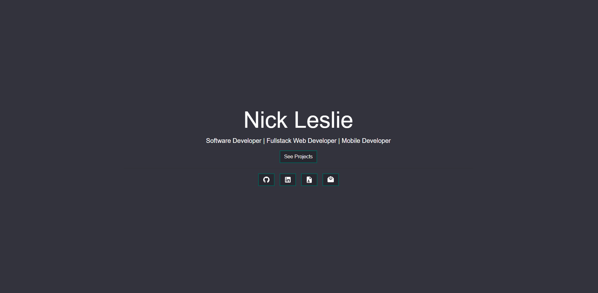
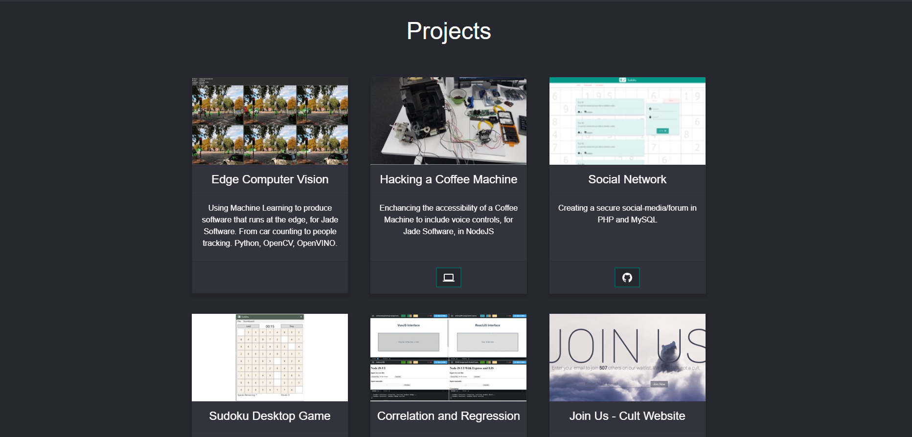

## Personal Website

Feel free to use this website any way you want.

## Features
- Mobile First
- 4K screen support
- Only need to fill in one file to update all information on the site
- Easy to customize
- Responsive
- Can handle picture and video for thumbnails

## How to use

- Edit "public/website_data.json" with your details/projects
- Add a formspree URL (https://formspree.io/) to direct messages to your email
- Add relevant thumbnails to the thumbnail folders (Don't forget to replace the paths found in "public/website_data.json")

And/or

- Update URL found in .env to point to your API, if needed

- Run "npm install" (Node/NPM required)
- Run "npm run build"

## License
- MIT
- Feel free to use this code as you see fit, set up your own website with it, whatever. Just give me an attribution somewhere on your site. Thanks
